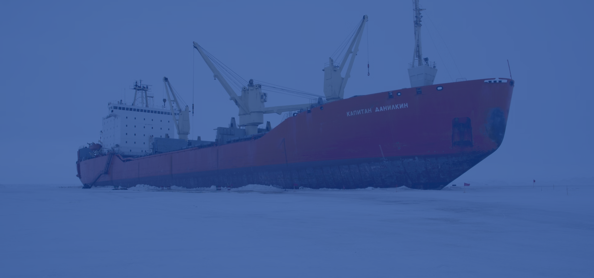

# SeaSpace – Военные корабли и морские перевозки ⚓🚢

Добро пожаловать на сайт компании SeaSpace — ведущего российского производителя современных военных кораблей и надёжного провайдера услуг по морской транспортировке грузов.
Мы проектируем, строим и поставляем высокотехнологичные военные корабли различных классов, а также обеспечиваем безопасную и эффективную доставку грузов по всему миру, включая сложные арктические маршруты.
Почему выбирают нас?

⚓ Инновационные военные корабли всех основных классов: от авианосцев до корветов
🧊 Уникальные ледокольные газовозы и суда повышенного ледового класса для Арктики
📦 Надёжные услуги по международным грузовым перевозкам
🔬 Передовые технологии и высочайшие стандарты качества
🤝 Индивидуальный подход, своевременная поставка и конкурентные цены

## Технологический стек

## Демка

https://sea-space-html-css-js.vercel.app/
